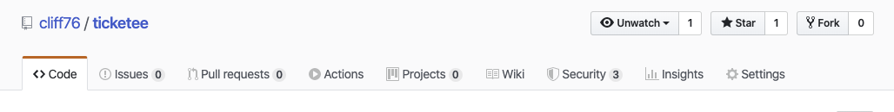
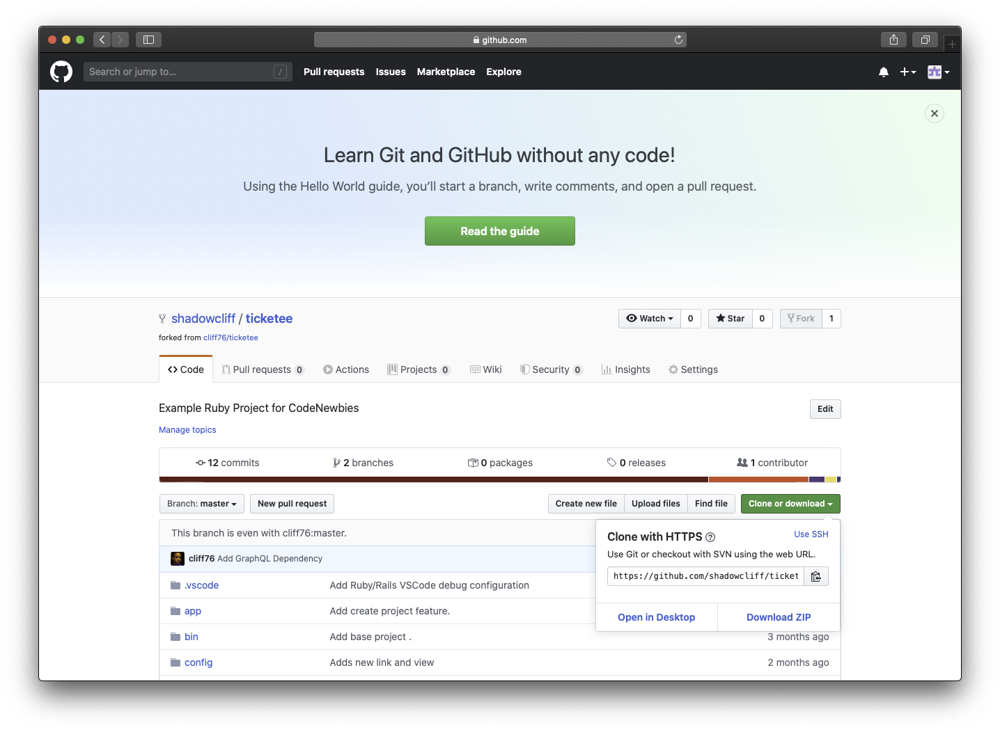

# TICKETEE

An exploration/experiment in open source for #CodeNewbies

## Get Started:

### Fork the app!

### Download/clone the app!

* Copy the URL in the clone with HTTPS window.
* Open a terminal of your choice
* Change to a directory where you keep your source code
  * For eg. `cd ~/source-code`
* Run the command `git clone [paste the url you copied here]`
   * in my case I used `git clone https://github.com/shadowcliff/ticketee.git`

### Open in your favorite editor...
I use VSCode but feel free to use Atom/Vim/RubyMine or whatever. Import the project using your IDE (Or in VSCode merely open the folder you cloned it to).

### Change some code locally...
I'm using this Documentation as an example of my first pull request.

### Commit and push your changes
Either use your IDE to commit and push the changes or run:
* `git add -A` 
* ...to stage all changed files for commiting 
* `git commit -m 'I changed some stuff to make stuff better`
* ...to perform the actual commit. (Use your own commit message.)
* `git push`
* ...to push your commit to your account on github!

### Create a Pull Request
Open Github in your browser and click the create Pull Request button!

### Wait for smoke (Feedback)
Operators are standing by! Someone working on this project should either approve your PR or give you feedback momentarily!